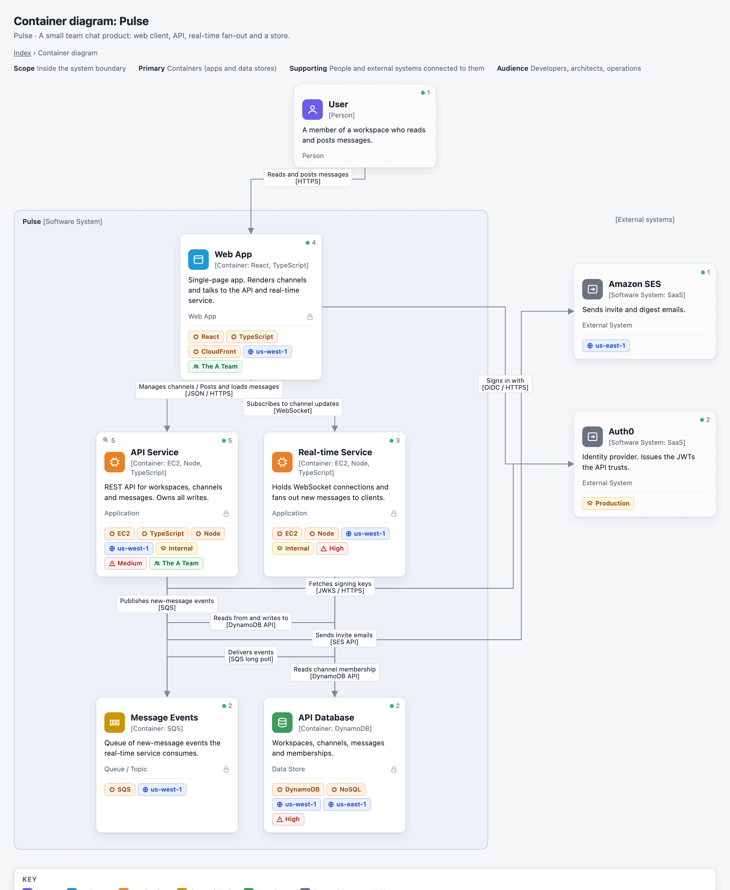
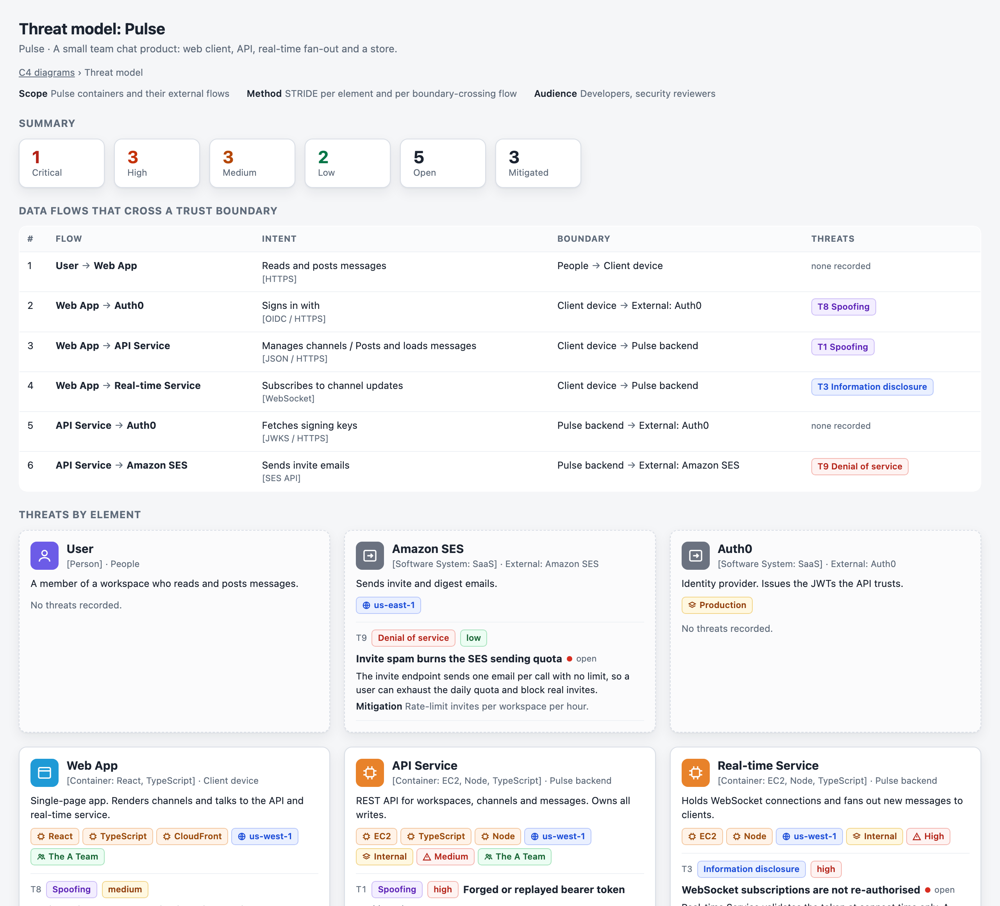

# public-skills

Agent skills that work in Claude Code, Cursor, GitHub Copilot and Codex. Each skill is a folder with a `SKILL.md`.

| skill | what it does |
| --- | --- |
| [`c4-diagrams`](skills/c4-diagrams/SKILL.md) | Reads a codebase and renders C4 architecture diagrams as light-mode HTML in `outputs/c4/` |
| [`threat-model`](skills/threat-model/SKILL.md) | Reads the C4 model and writes a STRIDE threat model as HTML in `outputs/threat-model/` |



Open [`examples/index.html`](examples/index.html) for the full sample set, and [`examples/threat-model/index.html`](examples/threat-model/index.html) for the matching threat model.



## Runbook

```bash
git clone https://github.com/coffeestained/public-skills.git
cd your-project
# pick the folder your tool reads
cp -r ../public-skills/skills/c4-diagrams .claude/skills/c4-diagrams   # Claude Code
cp -r ../public-skills/skills/c4-diagrams .cursor/skills/c4-diagrams   # Cursor
cp -r ../public-skills/skills/c4-diagrams .github/skills/c4-diagrams   # GitHub Copilot
cp -r ../public-skills/skills/c4-diagrams .agents/skills/c4-diagrams   # Codex
cp ../public-skills/skills/c4-diagrams/config.json.example config.json  # optional
# then ask your agent: "generate C4 diagrams for this project"
open outputs/c4/index.html
```

Swap `c4-diagrams` for `threat-model` to install the other skill. A symlink works too. `threat-model` reads `outputs/c4/model.json`, so run `c4-diagrams` first.

## License

MIT, Matthew Grady.
